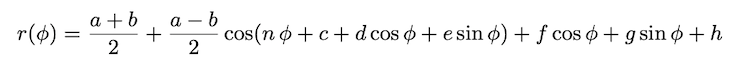

# Independent Concurrent Animations of Multiple Parameters

This essay describes the mathematical steps needed to synchronize independent animations of multiple parameters, running concurrently, so as to minimize the number of function evaluations.

More specifically, say you have a shape that depends on multiple parameters, such as the shape shown below,

and you'd like to animate changes to those parameters so that the shape animates in some fashion. In the examples below,

|  |  |  |
| --------------- | --------------- | --------------- |
|  |  |  |

all shapes are described by the same mathematical expression,

where `r(phi)` is the radial distance from the origin in a Cartesian coordinate system, as a function of the angle `phi`.

`n`, `a`, `b`, `c`, `d`, `e`, `f`, `g`, and `h` are all parameters. The animations were built by constructing two paths for each example, each path with their own individual values of these parameters, and then animating between the two paths. That's a *pair* of paths, *per example*.

Naively, for a given moment in animation time, you'd need to compute the entire path (ie, compute the value of the function above for a *reasonably large* number of values of `phi` between 0 and 2π radians, given the parameter values at that moment in time). That is computationally *very expensive*, especially if you're doing it 60 times a second to maintain a good frame rate.

A much more efficient way to create these animations is to compute a set of key frames and let the animation framework render the animation by animating between them. The key frames need to be computed only once. The animation framework can cache and efficiently interpolate them.

Still, one aspect of all the animations shown above is that all parameters are animated in the same fashion. What if you wanted, say, `a` to be animated *forwards* while `c` is animated *backwards*? What if `d` is supposed to *auto-reverse* and have a different *duration* than the other parameters? What if `b` and `f` are to have their animations repeated a finite number of times - a *different* number of times for each - while `g` is supposed to be animated "*forever*"? And what if all of these were supposed to happen concurrently?

Well, that's what this essay is about, namely, establishing the algorithm by which to compute the best set of key frames so as to minimize the number of function evaluations. Note that it is independent of the specific shape or path that you want to animate. It's not just for the function and examples above.

Originally written on October 2019.

## License

I'm sharing this work under the [Creative Commons Attribution-ShareAlike 4.0 International (CC BY-SA 4.0)](http://creativecommons.org/licenses/by-sa/4.0/) license. See the LICENSE file for more information.
